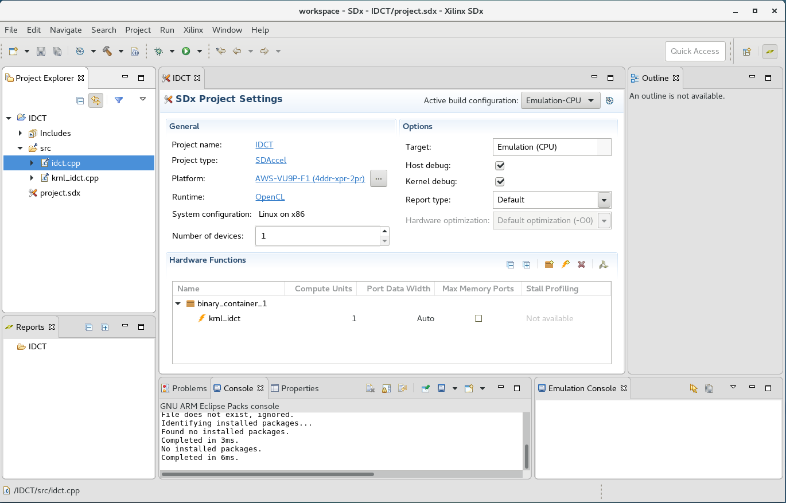
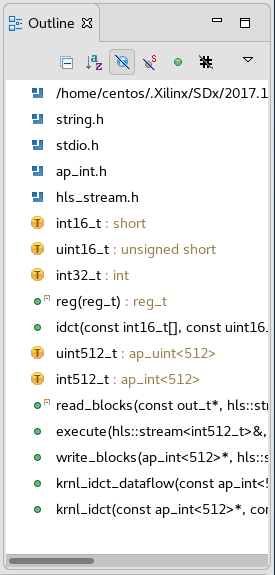
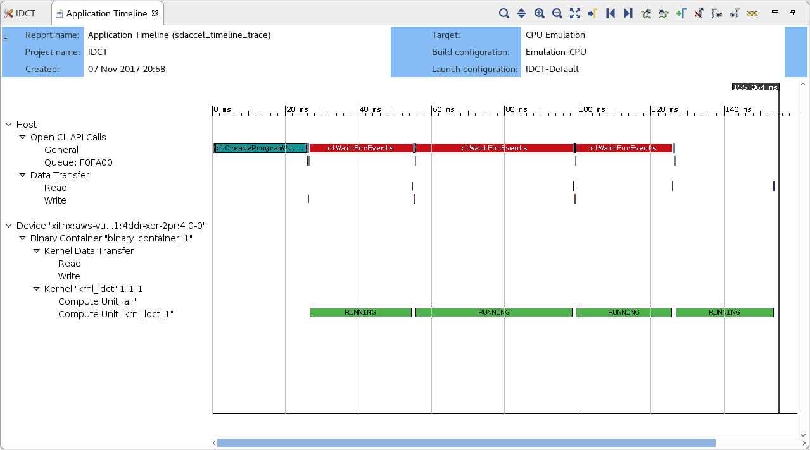
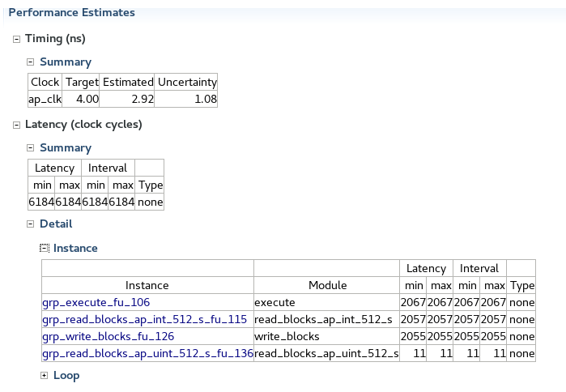
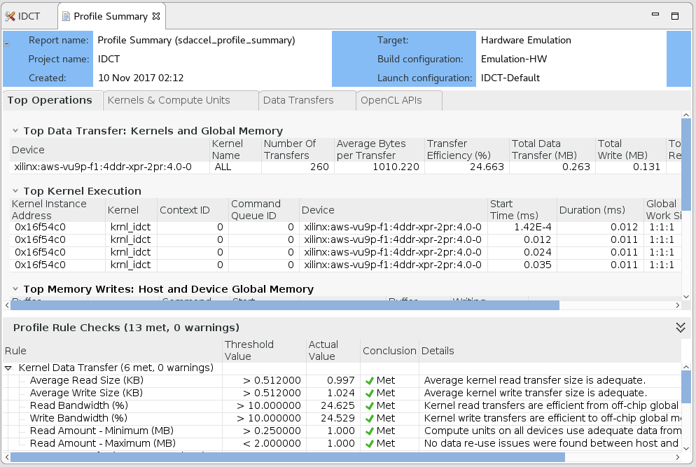
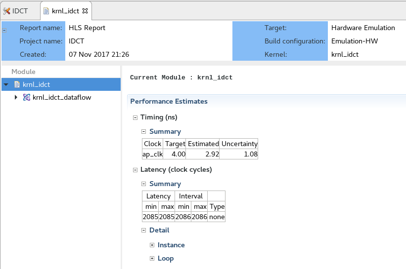
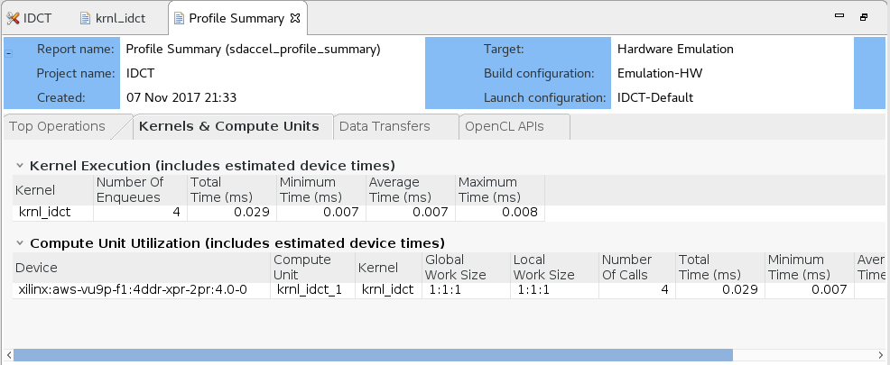
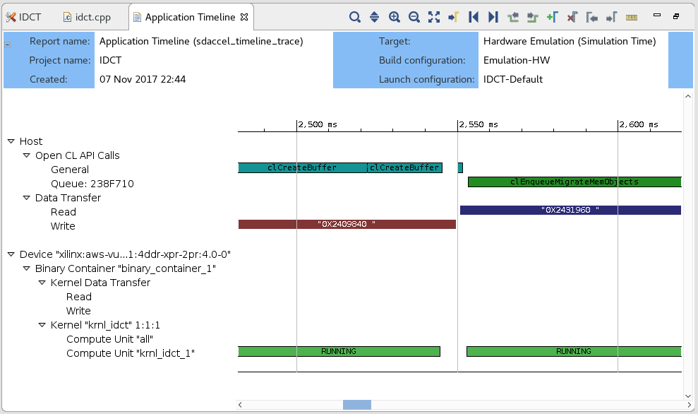

# IDCT Lab

## Contents
1. [Introduction](#Introduction)
1. [Environment Configuration and Workspace Setup](#Setup)
1. [Overview of Source Code](#CodeOverview)
1. [Run Emulations](#Emulation)
1. [Analyzing the Reports](#Analyzing)
1. [Optimization](#Optimization)
1. [Executing on F1](#Executing-on-F1)
1. [Conclusion](#Conclusion)
1. [References](#References)

<a name="Introduction"></a>
## Introduction  
This tutorial is designed to help teach the basics of the SDAccel development process. Areas covered include running software and hardware emulation and report analysis to help identify how to optimize code on the host and kernel side. Additionally, at the end of the tutorial, various links are provided to resources which provide details on various aspects of optimizing kernel code for projects.

The design is an Inverse Discrete Cosine Transform, which is used heavily in audio/image processing and is based off of the Fourier Transform. 

 
<a name="Setup"></a>
## Environment Configuration and Workspace Setup

Before the SDAccel tool suite can be started, the environment needs to be configured. Follow these steps:

1.  Open a new terminal by right-clicking anywhere in the Desktop area and selecting **Open Terminal**. 

1.  Change into the ~/aws-fpga directory and source “sdaccel_setup.sh”  

    ```
    cd ~/aws-fpga
    source sdaccel_setup.sh
    source $XILINX_SDX/settings64.sh 
	cd ~
    ```
    The setup might create some warning messages regarding missing libraries but these can be safely ignored.

1. Launch SDx with the command: 
    ```
    sdx
    ```
	
1. The **Eclipse Launcher** will start up displaying the workspace directory menu. This allows you to select the location of your workspace (and projects). To simplify this tutorial, a workspace directory containing the basic configuration for this example design is already included in the lab repository. To select this directory as workspace, we select **Browse...** and navigate to **/home/centos/SC17_Developer_Lab/workspace**. After clicking **OK** the **Eclipse Launcher** should read:  
      
    Click **OK** to confirm the selection. Please press **Wait** in the system warning, if loading the Eclipse environment takes longer than expected.  
	
	The provided workspace:
	* Defines the new project with the name **IDCT**
	* Has the project associated with the AWS platform from the aws-fpga platform directory 
	* Includes the host (**idct.cpp**) and kernel (**krnl_idct.cpp**) source files
	* Defines the name of the xclbin container as **binary_container_1**
	* Defines the **krnl_idct** function to be the top hardware function in the xclbin container
    * Maps the ports of the **krnl_idct** function to utilize two different DDR memories; one for reads and one for writes. 
	* Adds the xclbin container to be the first argument provided to the executable.

	Most of this information is displayed on the **SDX Project Settings** window.  
 
    

1. The SDx Project Settings window is prominently displayed in the center of the GUI. It states the project name, the selected platform (**AWS-VU9-F1**) and the xclbin container (**binary_container_1**) with the top level kernel function (**krnl_idct**).  

    The following is a brief description of the different sections of the default GUI elements (see above for reference):
    * The **main menu** bar is located on the top. This menu bar allows direct access to all general project setup and GUI window management tasks. As most tasks are performed through the different setup windows, the main menu is mostly used to recover from accidently closed windows or to access the tool help.
    * Directly below the main menu bar is the **SDAccel toolbar**.  This provides access to the most common tasks in a project. From left to right, these are: File Management functions (new, save, save all), Configuration Management, Build, Build All, Start Debug, and Run. Most buttons have a default behavior as well as pulldowns.
    * The **Project Explorer** window occupies the top left hand side of the GUI. This window is used to manage and navigate through project files. In the expanded **src** folder you should be able to see the source files of the project. 
    * In the middle is the **SDx Project Settings** window. This window is intended for project management and presents the key aspects of an SDx Project. 
    * The **Outline** viewer on the right hand side is used for file navigation. The content of the outline varies depending on the file currently selected in the main window.
    * In the bottom left section is the **Reports window**. This allows easy access to all reports generated by SDAccel. 
    * The remaining windows along the bottom of the main window accommodate the various consoles and terminals which contain output information relating to individual SDAccel executables. Typical output examples are compilation errors or the tool output when running.  

<a name="CodeOverview"></a>
## Overview of Source Code  

As mentioned earlier, two files are used to fully code this design. The **idct.cpp** contains the code running on the CPU (host), while the file **krnl_idct.cpp** contains the accelerator code running on the FPGA (kernel).

1. Open the kernel file by double clicking the icon **Project Explorer -&gt; src -&gt; krnl_idct.cpp**.  

    

    The green dots in the **Outline** viewer (above) allows for rapidly lookup of the functions. Here is a brief description of the individual functions ordered with respect to the call hierarchy.
	* **idct_kernel**: Is the top level function dedicated to be implemented in hardware. It is used in this example to specify the interface properties.
	* **krnl_idct_dataflow**: Top level implementation function encapsulating the basic implementation blocks.
	* **read_blocks**: Responsible for mapping the AXI interface to hls::streams.
	* **write_blocks**: Responsible for mapping from the output hls::stream to the output AXI interface.
    * **execute**: Performs the actual IDCT computation. It iterates over the number of blocks transmitted and calls the IDCT on each 8x8 matrix.
	* **idct**: Modified version of the idct algorithm to facilitate good hardware implementation.
	* **reg**: Helper function to guide HLS synthesis flow.
	
1. Open the host file **idct.cpp** by double clicking the file at the bottom in **Project Explorer**.  

    

    Again, use the **Outline** viewer to rapidly visit the different functions:
	* **main**: The C++ Main function. It initializes the test vectors, performs the OpenCL Host Code Setup (see next section), runs the software model, runs the accelerator implementation, releases the OpenCL resources, and compares the IDCT results of the software model with the accelerator implementation. In the end, if the model isn't emulated, statistics regarding the wall clock execution time are printed.
    * **runCPU**: This function calls the software idct for each 8x8 block.
	* **idctSoft**: Original code implementing the IDCT algorithm in software. 
	* **runFPGA**: This function calls the wrapper functions around the runtime OpenCL functions. These **write**, **run**, **read**, and **finish** functions are explained later in greater detail when focusing on the host code optimization. 
	* **oclDct**: This class is used to encapsulate the OpenCL runtime interface calls. In addition to the already mentioned ones, it provides a **constructor**, **destructor**, and initialization (**init**) method. 
	* **aligned_allocator**, **smalloc**, **load_file_to_memory**, and **getBinaryName** are small helper functions used during test vector generation and OpenCL Host Code Setup.

<a name="Init"></a>
### OpenCL Host Initialization  

Before we start looking at the details of the kernel and host implementation of this example, it is worthwhile to briefly have a look at the OpenCL setup steps in the host. This code is very similar between SDAccel projects and might often only vary in the error handling. Towards that end, please open the **idct.cpp** file from the **Project Explorer** and search for the line (Ctrl+L 580):

``` C
  // *********** OpenCL Host Code Setup **********
```

People familiar with OpenCL should be very familiar with these steps. All of these interface functions are documented by the OpenCL maintainer [(Khronos group)](https://www.khronos.org). In the code, the following OpenCL calls are made.

* **clGetPlatformIDs**: This function queries the system to identify the different OpenCL platforms. It is called twice as it first extracts the number of platforms before extracting the actual supported platforms.
* **clGetPlatformInfo**: Get specific information about the OpenCL platform, such as vendor name and platform name.
* **clGetDeviceIDs**: Obtain list of devices available on a platform.
* **clCreateContext**: Creates an OpenCL context, which manages the runtime objects.
* **clGetDeviceInfo**: Get information about an OpenCL device like the device name.
* **clCreateProgramWithBinary**: Creates a program object for a context, and loads specified binary data into the program object. The actual program is obtained before this call through the load_file_to memory function.
* **clCreateKernel**: Creates a kernel object.
* **clCreateCommandQueue**: Create a command-queue on a specific device.

Note, all objects accessed through a **clCreate...** function call are to be released before terminating the program by calling **clRelease...**. This avoids memory leakage and clears the locks on the device.

Talk about overall structure host, kernel...

<a name="Emulation"></a>
## Run Emulations (Software/Hardware)  

This section demonstrates the software/hardware emulation flow. 

The project is now setup and ready for compilation and emulation. The SDx environment uses Makefiles to perform incremental compilation of the project. This means that unless file changes require the recompilation of the host code or of the kernel code, no compilation is performed.

1. In the upper right corner of the **SDx Project Settings** window, the **Active build configuration** is shown. Ensure that **“Emulation-CPU”** is selected.  

1. To run software emulation for the design, click the **Run** button, .

    CPU-Emulation is used to verify the algorithm and identify syntax issues. The C/C++ kernel and host code is compiled before execution of the code emulates the designs overall behavior. Notice that the **Console** has a detailed build log of the compilation of the kernel and the host code. Once the build is complete, an output console will display the standard output the application produces.  
	
1. In the **SDx Project Settings** window, change the **Active build configuration** to **Emulation-HW**.

    Now the project is set for running a more detailed emulation compared to the software emulation. In this emulation mode the actual Register Transfer Logic (RTL) generated from the C/C++ Kernel description is simulated and run together with the host code application. 

1. Click the **Run** button again.

    The runtime of the Hardware emulation will take longer than the
Software Emulation because the kernel code is being compiled to create
a more detailed simulation model. The more detailed simulation
models allow more accurate reporting of kernel performance in
comparison to software emulation. This step should be used in helping
identifying performance issues of the design.

The next section will focus on analyzing the reports produced by the emulation runs. 

<a name="Analyzing"></a>
## Analyzing the Reports  

This section covers how to locate and read the various reports generated by the emulation runs. The goal of the section is to understand the analysis reports of SDAccel before utilizing them in the next section.  
    

1. The **Reports** window displays a tree layout of folders and reports for all runs and open projects (see above). The top level shows the **IDCT** project for which we have executed two runs (**Emulation-CPU** and **Emulation-HW**).

    Expanding the **Emulation-CPU** folder shows the **IDCT-Default** run configuration. Running this configuration created a **Profile Summary** and **Application Timeline** report. 

    Similarly, the **Emulation-HW** folder contains all reports created with this build configuration. As this configuration performs High-Level Synthesis under the hood, first estimates regarding the performance of the actual hardware implementation are available. These are summarized in **System Estimate**. The full output of the High-Level Synthesis run (**HLS Report**) is located in the **binary_container_1 -&gt; krnl_idct** subhierarchy. Similar to the emulation-cpu flow, the run configuration **IDCT-Default** also produced a **Profile Summary** and an **Application Timeline** report.

1. Open the **Emulation-CPU Profile Summary** by double clicking the icon (see below).  
     

    This report provides data related to how the application runs. Notice that the report has four tabs: **Top Operations**, **Kernels & Compute Units**, **Data Transfers**, and **OpenCL APIs**. Click through and study each of the tabs and become familiar with the data they show. Following is a summary of each:

    * **Top Operations**: Shows all the major top operations of memory transfer between the host and kernel to global memory, and kernel execution. This allows you to identify throughput bottlenecks when transferring data. Efficient transfer of data to the kernel/host allows for faster execution times.
    
    * **Kernels & Compute Units**: Shows the number of times the kernel was executed. Includes the total, minimum, average, and maximum run times. If the design has multiple compute units, it will show each compute unit’s utilization. When accelerating an algorithm, the faster the kernel executes, the higher the throughput which can be achieved. It is best to optimize the kernel to be as fast as it can be with the data it requires.
    
    * **Data Transfers**: This tab has no bearing in software emulation as no actual data transfers are emulated across the host to the platform. In hardware emulation, this shows the throughput and bandwidth of the read/writes to the global memory that the host and kernel share.
    
    * **OpenCL APIs**: Shows all the OpenCL API command executions, how many time each was executed, and how long they take to execute.

1. Open the **Application Timeline** report by double clicking the icon in the **Emulation-CPU** hierarchy.
    
	
    As the above image shows, the **Application Timeline** shows a visual representation of the execution time of the **OpenCL APIs**. It illustrates, in what order the APIs execute across the emulation threads.  
    

1. Open the **HLS Report** of the **Emulation-HW** run, by double clicking on the icon.  

    

    The **HLS Report** (above) is specific to the kernel code, and how it translates to the platform. It contains information about clocking, resources, device utilization, and more. For the purpose of this tutorial, the only section of this report to pay attention to is the **Performance Estimates**. This section provides information on the latency of the kernel, as well as loop implementation details.  

1. To establish a baseline, please note the following data from the **HLS Report -&gt; Performance Estimates** section:

    - Latency (min/max):
    - Interval (min/max):
	
1. Focus in on the **HLS Report** of the **krnl_idct_dataflow** function (select **krnl_idct_dataflow** from module list).  

    This provides detailed information for a specific module in the synthesized hierarchy.
 	
1. Expand the (**Performance Estimates -&gt; Latency -&gt; Detail -&gt; Instance**) part of the report.  
    
	
	The table illustrates the latency and interval numbers of each instance contained in the **krnl_idct_dataflow** function. This information will be utilized for optimization in the next section. 

1. Open the **Profile Summary** of the **Emulation-HW** run (double click icon).

    

    Notice that compared to the CPU emulation, the hardware emulation displays more data as well as a **Profile Rule Checks** section. This section provides information relating to the overall design performance. Profile rules examine the profile data and compare them to general threshold values. If a check does not meet the threshold value, the right hand column provides guidance on how to improve design performance.

1. Click on the **Kernels & Compute Units** tab of the report and locate the **Kernel Total Time**.

    - Kernel Total Time (ms):

    Note this number as another reference point to compare after optimization.

1. Click **X** on each of the report tabs to close the windows.

This concludes the introduction to the SDAccel GUI Analysis capabilities. The next section will focus on some of the performance aspects of the current implementation and how they can be improved.  

<a name="Optimization"></a>
## Optimization   

In the previous section you familiarized with the SDAccel Performance Analysis capabilities. The next stage is to utilize the analysis capabilities to determine results of kernel optimization procedures. This example will deal with DATAFLOW optimization on for the accelerator and software pipelining on the host side.

<a name="KernelOpt"></a>
### Kernel Optimization  

1. Open the kernel file **krnl_idct.cpp** by double clicking the file at the bottom in **Project Explorer**.  

    This allows us to take another closer look of the C++ source code implementation. At the end of the file is the krnl_idct top function which is used to separate the HLS interface pragmas from the actual kernel definition function (krnl_idct_dataflow) for readability. The krnl_idct_dataflow function contains four blocks:

    * Two read_blocks responsible for mapping the AXI interface to a data stream
 
    * One write_block responsible for mapping from the data stream to the output AXI interface
 
    * One execute block which contains the IDCT computation

    The execute function performs multiple idct computations per kernel execution. The actual number is provided to the kernel as an argument. Each computation is prepended by reading the wide input data streams and filling the 8x8 matrix, and similarly post processed by writing into the wide output streams. 
    
    **Note:** The coefficients of the read operation are read only once as they are considered constant for all idct computations.

1. In the previous section we identified that the critical path through the **krnl_idct_dataflow** function (read, execute, write) have roughly the same latency numbers. In addition the three functions are communicating through FIFO (hls::streams). This is the recommended coding style which should be used whenever possible to exhibit streaming behavior and allow DATAFLOW optimization.

1. To enable dataflow optimization, just uncomment the **pragma DATAFLOW** already present in the krnl_idct_dataflow function. Also comment out the three **pragma HLS stream** statements from the function.
	
    The dataflow optimization allows each of these functions to execute as independent processes. This results in overlapping and pipelined execution of the three functions instead of sequential execution. Therefore, the FIFO channels between the different processes do not need to buffer the complete dataset anymore but can directly stream the data to the next block. 

1. Save the file (Ctrl-S), and click  to rebuild the **Emulation-HW** configuration of the project.

1. This results in the following new HLS Report (**Emulation-HW -&gt; binary_container_1 -&gt; krnl_idct -&gt; HLS Report).
    	

   Compare the new latency numbers reported in the **Performance Estimates** section with the previous numbers and you will note considerable improvement based on the DATAFLOW optimization.  
    - Latency (min/max):
    - Interval (min/max):

1. Run the Hardware Emulation flow by clicking the run button, . Open the **Emulation-HW -&gt; Profile Summary** and select the tab **Kernels & Compute Units**.  

    

    Compare the **Kernel Total Time (ms)** with the results from the unoptimized run.
	
<a name="HostOpt"></a>
### Host Code Optimization

1. Locate the **runFPGA** function in the **idct.cpp** source file using the **Outline** view. 

    This function writes, runs, and reads back from the kernel, for each idct kernel invocation until all blocks are processed. In the end it waits for the complete command queue to finish.

    The majority of the **write(...)** function code performs buffer management. It creates new OpenCL buffers for the different sections of the inputs and output. All the way at the end of the write function, there is a call to **clEnqueueMigrateMemObjects** which is used to transfer the data to the kernel. Completion of the write is indicated by an **inEvVec** event. 
	
	The **run(...)** function sets up the kernel arguments (**clSetKernelArg**) and then enqueues the task (**clEnqueueTask**). The run function is allowed to start once the input vectors are fully transferred (**inEvVec**) and reports completion through the **runEvVec**.
	
	Finally there is the **read(...)** function which simply retrieves the data from the output buffer, synchronized through **runEvVec** and **outEvVec**.
	
1. Open the **Application Timeline** of the **Emulation-HW** run.  

    Even from the zoomed out view, we can identify gaps between the different kernel runs. Zooming in (**Left mouse drag**) across the gaps, will result in a view similar to the one below:  
    

    The bottom bars show when the IDCT compute unit is RUNNING. The bar on the left corresponds to one execute of the compute unit and the bar on the right corresponds to the next execution. We can clearly see that there is a gap between two invocations of the compute unit. The Data Transfer section of the timeline shows that this gap is filled by Read and Write operations. The Read operation is to retrieve the results from the execution which just finished and the Write operation is to send inputs for the next execution. This represents a sequential execution flow of each iteration.  
	
    If we take another look at the host code, we can actually see in addition to the **clFinish()** function call another synchronization point through a call to **clWaitForEvents(...)** in the **write(...)** function. It gates the release of memory and event resources based on completion of the task (**outEvVec**). If we look for the definition of **outEvVec**, we can see that the number of elements in this vector is defined through the **NUM_SCHED** define. 
	
1. Locate the definition of **NUM_SCHED** through the **Outline** viewer in the **idct.cpp** host code.
	
	The **1** explains the currently observed behavior, as new tasks (write, run, read) are only enqueued when the previous has completed effectively synchronizing each loop iteration. If we deploy software pipelining and enable for example **6** blocks to be enqueued for processing, we will effectively allow the kernels to execute the kernels continuously.
	
1. Let us change the **NUM_SCHED** to **#define NUM_SCHED 6**, save the file Ctrl-S, and rerun HW-Emulation, . 

    This rebuilds only the host code and reruns the executable. Once competed, reopen the **Application Timeline** and you will be able to observe that the data transfer is performed concurrently with the read and write operations.  
    
	
	Note, hardware emulation has a larger potential that other system tasks might interrupt and slow down communication. Thus the effect of software pipelining is considerably higher when running on the actual hardware. 

<a name="Executing-on-F1"></a>
## Executing on F1 

Now we are ready to run a fully optimized version of the design. However, the process to create the actual FPGA image (xclbin) takes too much time for this tutorial. From a SDAccel tool perspective, the xclbin creation would simply require to switch the active build configuration to System and rebuild.

1.  Once the xclbin is available, we can **close** SDAccel. 

1.  On the Amazon F1 instance it is necessary to register the kernel with the secure storage system. This is performed with the help of the **create_sdaccel_afi.sh** script. Running this script kicks off the registration process and it's completion, after approximately one hour, can be verified using the following command from the terminal.

    ``` shell
    aws ec2 describe-fpga-images --fpga-image-ids afi-0d59c0f2d5fe9df1f
    ```

    You can try it with the preregistered AFI ID for this tutorial: **afi-0d59c0f2d5fe9df1f**. The output of this command should contain:

    ``` shell
    ...
    "State": {
        "Code": "available"
    },
    ...
    ```

    A good starting point regarding the specifics of the Amazon SDAccel flow is the 

1. During runtime, the FPGA image is accessed through a secure xclbin handle "binary_container_1.awsxclbin". This handle is provided to you in your idct directory (~/SC17_Developer_Lab/idct/xclbin/binary_container_1.awsxclbin). Since there is no difference in the host executable, we can run the hardware emulation idct executable with the secure handle, executing the algorithm on the FPGA.

    ``` shell
    sudo sh
    source /opt/Xilinx/SDx/2017.1.rte/setup.sh
    cp /home/centos/SC17_Developer_Lab/workspace/IDCT/Emulation-HW/IDCT.exe .
    ./IDCT.exe /home/centos/SC17_Developer_Lab/idct/xclbin/binary_container_1.awsxclbin
    ```

    Please note, the performance differences between the CPU run and the FPGA accelerated implementation.

<a name="Conclusion"></a>
## Conclusion  

In this Lab, you learned:
* The basic setup of a project.
* How to run Software and Hardware Emulation for a specific project.
* How to read the various reports generated by the different emulation runs with emphasis on key elements used in identifying areas for optimization improvements.
* How to use some basic pragmas in the kernel code to increase performance.
* How to analyze communication between host code and an implementation kernel.
 
<a name="References"></a>
## References  

[UG902 Vivado Design Suite User Guide: High-Level Synthesis](https://www.xilinx.com/support/documentation/sw_manuals/xilinx2017_2/ug902-vivado-high-level-synthesis.pdf)  
[UG1023 SDAccel Environment User Guide](https://www.xilinx.com/support/documentation/sw_manuals/xilinx2017_2/ug1023-sdaccel-user-guide.pdf)  
[UG1207 SDAccel Environment Optimization Guide](https://www.xilinx.com/support/documentation/sw_manuals/xilinx2017_2/ug1207-sdaccel-optimization-guide.pdf)  
[UG1253 – SDx Pragma Reference Guide](https://www.xilinx.com/support/documentation/sw_manuals/xilinx2017_2/ug1253-sdx-pragma-reference.pdf)
  
  
  
[More references on SDAccel can be found in the Cloud](https://www.xilinx.com/products/design-tools/acceleration-zone.html#knowledgeCenter)


